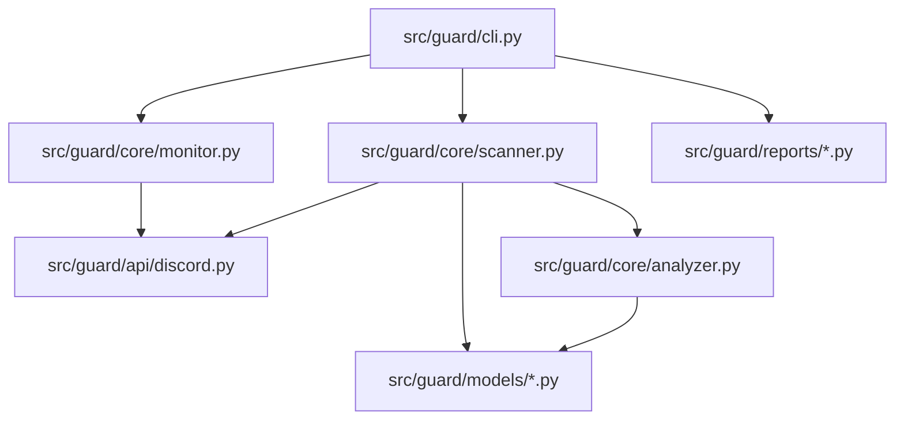

# discord-guard: A Proactive Defense Against Discord Session Hijacking

I built this CLI tool to empower Discord users to audit their account security, analyze authorized application risks, and monitor for suspicious activities in real-time. It bridges the gap between Discord's internal security settings and the user, providing a professional-grade auditing experience from the terminal.

## 🌟 About the Developer
Hello! I'm **Ezequiel Ranieri**. I am a self-taught developer who discovered the world of programming through curiosity and a passion for building things. Everything I know—from architecture patterns to distributed systems—I've learned on my own through books, technical documentation, videos, and endless hours of practice.

I created this project to consolidate and demonstrate my understanding of software development. I don't claim to be a senior architect; I am a dedicated learner who enjoys solving complex technical challenges and building robust software that works under pressure.

**Contact:**
- **Email:** ez.ranieri@gmail.com
- **GitHub:** https://github.com/ezequielranieri
- **LinkedIn:** https://www.linkedin.com/in/ezequielranieri/

---

## 🎯 Why this project?
This project was born out of a real-world incident where a close friend lost his Discord account to a token hijacking attack. I realized that most users have no visibility into what permissions they've granted to third-party apps or where their sessions are active until it's too late. I built `discord-guard` to explore how to interact with Discord’s REST API asynchronously and to create a tool that provides immediate, actionable security insights for non-technical users.

## 🏗 System Architecture / Data Flow
My project follows a modular, service-oriented architecture designed to handle asynchronous operations efficiently:

1. **CLI Orchestration**: Using `Typer`, I manage the user interface and command execution, ensuring a polished and interactive experience.
2. **Async Data Acquisition**: The `Scanner` component fetches account data, authorized apps, and active sessions in parallel using `asyncio.gather` to minimize latency.
3. **Risk Analysis Engine**: A dedicated service that processes the raw API data against a set of security heuristics to calculate a 0-100 risk score.
4. **Real-time Monitoring**: A polling loop that detects deltas in the account state, such as mass unfriending or sudden server joins, and triggers visual alerts.
5. **Report Generation**: A separate layer that transforms internal risk models into structured PDF or JSON files for archival.



## 🛠 Tech Stack
- **Python 3.12**: The core language, chosen for its robust support for asynchronous programming and security tooling.
- **Typer & Rich**: Used to build a professional-grade terminal interface with tables, progress bars, and color-coded status reports.
- **httpx**: My choice for high-performance, asynchronous HTTP communication with Discord's REST API.
- **Pydantic V2**: Provides strict data validation and modeling, ensuring the application handles API responses safely and predictably.
- **reportlab**: Integrated to generate professional PDF security audits directly from the command line.
- **structlog**: Implementation of structured logging to ensure technical events are tracked without exposing sensitive user tokens.

---

## 🚀 Quick Start Guide

### Prerequisites
- Python 3.12 or higher.
- A valid Discord User Token (instructions on how to get it are included in the terminal help).

### Installation
```bash
# Clone my repository
git clone https://github.com/ezequielranieri/discord-guard
cd discord-guard

# Install the package in editable mode
pip install -e .
```

### Running Locally
```bash
# Run a security scan
discord-guard scan

# Start real-time monitoring
discord-guard monitor --interval 30

# Generate a PDF report
discord-guard report --format pdf --output my_security_audit.pdf
```

## 💡 Usage / Endpoints
The application is entirely CLI-driven. Here is how you interact with it:
*   **Scanning**: Use `discord-guard scan`. The tool will prompt for your token (masked for privacy), analyze your account, and then ask if you want to interactively revoke any suspicious apps it found.
*   **Monitoring**: Use `discord-guard monitor`. This keeps the process alive, checking your account state every few seconds. If a sudden change (like a mass unfriend spike) is detected, it will trigger a visual and audible alert.
*   **Reporting**: Use `discord-guard report`. This is a non-interactive way to generate a full security document in PDF or JSON format for your records.

---

## 🧠 What I Learned
Developing this project taught me a lot about handling sensitive user credentials and managing asynchronous state. I learned the importance of "Privacy by Design"—ensuring that tokens never touch the disk and are masked in every log entry.

However, revisiting my code today with more experience, I see several areas I would improve:
1. **Connection Management**: My `DiscordClient` currently creates a new `httpx.AsyncClient` for every request. This is an antipatTM that increases latency. Today, I would implement a persistent client session to reuse TCP connections.
2. **Configuration Over Code**: I hardcoded some detection thresholds (like 5 friends removed for a "mass" alert). I should have moved these into a configuration file or environment variables to allow user customization.
3. **State Persistence**: The monitor's state is purely in-memory. If you restart the tool, the "previous state" is lost. I would now use a lightweight local cache (like SQLite or a JSON file) to keep track of account state across sessions.
4. **Decoupling the Reporting Logic**: I would implement a Factory pattern for the report generators to make it easier to add new formats without modifying the core CLI logic.

## 🗺 Roadmap
- **Persistent Local State**: Implement a local database to track account changes over long periods.
- **Webhook Integration**: Add the ability to send alerts to a Discord Webhook so users can be notified on their mobile devices.
- **Improved Risk Heuristics**: Integrate a community-sourced list of known malicious Discord applications.

Thank you for checking out my work! I'm always open to feedback and looking for new opportunities to learn and grow.
